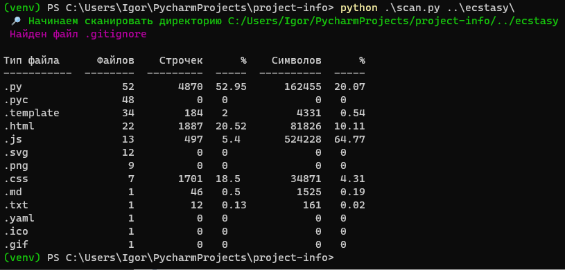

## Сканер файлов проекта

```shell
$ python scan.py -h
usage: scan.py [--full] directory

Сканирует директорию, ищет файлы

positional arguments:
  directory   Путь до папки с проектом

optional arguments:
  -h, --help  show this help message and exit
  --full      Фильтровать по .gitignore файлу, если он имеется
```


